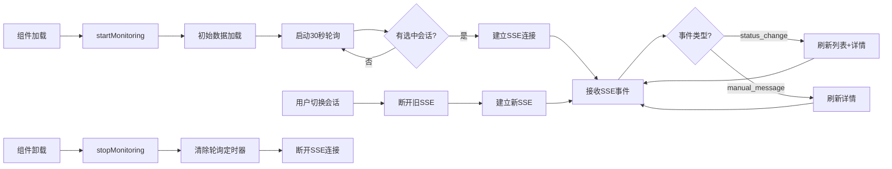

# AI 监管/人工接管 API Contract (v2.6)

> **版本**: v2.6
> **更新时间**: 2025-11-25
> **变更**: 新增管理员功能和JWT权限控制、修复JWT时区bug

## ⚠️ Coze API 强制约束

**本文档中的所有 API 接口必须遵守以下 Coze 平台约束**：

### 🔴 核心约束声明

#### 1. 不可修改的核心接口（涉及 Coze API）

以下接口**直接调用 Coze API**，其核心逻辑**不可修改**，只能扩展：

| 接口 | Coze 依赖 | 约束级别 | 说明 |
|------|-----------|----------|------|
| `POST /api/chat` | ✅ 直接调用 | 🔴 **不可修改** | SSE 流式响应、session_name 隔离必须保持 |
| `POST /api/chat/stream` | ✅ 直接调用 | 🔴 **不可修改** | SSE 事件格式（`type:message/done`）不可变 |
| `POST /api/conversation/new` | ✅ 直接调用 | 🔴 **不可修改** | Conversation ID 生成逻辑必须由 Coze 控制 |

**强制要求**：
- ✅ **必须保持**：SSE 流式响应格式（`event:` 和 `data:` 行）
- ✅ **必须保持**：OAuth+JWT 鉴权流程和 `session_name` 参数
- ✅ **必须保持**：Coze API payload 的必需字段（`workflow_id`, `app_id`, `additional_messages`）
- ❌ **禁止修改**：Coze API 响应的解析逻辑（从顶层提取 `type` 和 `content` 字段）

**参考文档**：
- 📘 [TECHNICAL_CONSTRAINTS.md](./TECHNICAL_CONSTRAINTS.md) - 第 2-5 节（Coze 平台限制）
- 📘 [coze.md](./coze.md) - 第 12 节（Coze API 约束规范）

#### 2. 允许扩展的新接口（不涉及 Coze API）

以下接口是**新增功能**，不直接调用 Coze API，可以自由设计：

| 接口 | Coze 依赖 | 约束级别 | 说明 |
|------|-----------|----------|------|
| `POST /api/manual/escalate` | ❌ 无依赖 | ✅ **可自由设计** | 会话状态管理，不影响 Coze API |
| `GET /api/sessions/{session_name}` | ❌ 无依赖 | ✅ **可自由设计** | 本地状态查询 |
| `POST /api/manual/messages` | ❌ 无依赖 | ✅ **可自由设计** | 人工消息通道（通过 SSE 推送） |
| `POST /api/sessions/{session_name}/release` | ❌ 无依赖 | ✅ **可自由设计** | 状态转换逻辑 |

**扩展要求**：
- ⚠️ 新接口的异常不应导致核心 AI 对话功能失败
- ⚠️ 必须在响应格式中明确标注是否涉及 Coze API 调用
- ⚠️ 必须通过向后兼容性测试

#### 3. SSE 流扩展规范

**现有 SSE 事件格式（不可变）**：
```
data: {"type":"message","content":"AI回复内容"}\n\n
data: {"type":"done","content":""}\n\n
```

**允许的扩展（新增事件类型）**：
```
data: {"type":"manual_message","role":"agent","content":"人工回复","agent_info":{...}}\n\n
data: {"type":"status","status":"pending_manual","reason":"keyword"}\n\n
```

**约束**：
- ✅ 允许添加新的 `type` 值（如 `manual_message`, `status`）
- ❌ 禁止修改现有 `type: message` 和 `type: done` 的格式和含义
- ✅ 新事件类型必须向后兼容（不影响只识别 `message/done` 的客户端）

---

本文件在 `PRD_REVIEW.md` 建议的基础上，重新定义需要实现/扩展的接口，确保 MVP（P0）优先交付 4 个核心接口，再在 P1 引入更多能力。

## 通用约定
- **响应格式**：
  ```json
  { "success": true, "data": {...} }
  { "success": false, "error": "错误信息", "code": "ERROR_CODE" }
  ```
- **鉴权**：除用户侧的 `POST /api/manual/escalate`、`POST /api/manual/messages`(role=user) 外，其余接口均需 `Authorization: Bearer <JWT>`，且 JWT 中必须包含 `role` (`agent`/`admin`)。  
- **会话标识**：`session_name` 与前端的 `sessionId` 完全一致。  
- **时间戳**：统一使用 **UTC 秒级时间戳**（数字），前端负责格式化。  
- **History 限制**：仅返回最近 50 条消息，若更多可在后端归档。

## SessionState 数据结构（v2.5 扩展）

```json
{
  "session_name": "session_123",
  "status": "bot_active",
  "conversation_id": "conv_xxx",

  // ⭐ v2.5 扩展：用户画像增强（Fiido E-bike 业务）
  "user_profile": {
    "nickname": "访客A",
    "vip": false,

    // 新增：GDPR 合规字段
    "gdpr_consent": true,
    "marketing_subscribed": false,

    // 新增：地理位置与语言
    "country": "DE",          // 国家代码（ISO 3166-1）
    "city": "Berlin",         // 城市名称
    "language": "de",         // 语言代码（ISO 639-1）
    "currency": "EUR"         // 货币代码（ISO 4217）
  },

  "history": [
    { "id": "msg_1", "role": "user", "content": "你好", "timestamp": 1737000000 },
    { "id": "msg_2", "role": "assistant", "content": "您好！", "timestamp": 1737000001 }
  ],

  "escalation": {
    "reason": "keyword",
    "details": "命中关键词: 人工",
    "severity": "high",
    "trigger_at": 1737000300
  },

  "assigned_agent": { "id": "agent_01", "name": "Alice" },
  "mail": { "sent": false, "email_to": [] },
  "ai_fail_count": 0,
  "last_manual_end_at": null
}
```
> `audit_trail` 单独存储：`[{ "status_from": "...", "status_to": "...", "operator": "...", "timestamp": 1737000400 }]`

---

## P0 核心接口

### 1. `POST /api/manual/escalate`
- **用途**：用户点击“人工客服”或监管触发后调用。  
- **Body**：
  ```json
  { "session_name": "session_123", "reason": "user_request" }
  ```
- **响应**：`data` 返回最新 `SessionState`。  
- **错误**：`409 MANUAL_IN_PROGRESS`（已有人工会话）。

### 2. `GET /api/sessions/{session_name}`
- **用途**：前端刷新会话历史 & 状态。  
- **响应**：
  ```json
  {
    "success": true,
    "data": {
      "session": SessionState,
      "audit_trail": [...]
    }
  }
  ```
- **权限**：用户端/内部系统均可，无需角色鉴权（仅根据 session token）。

### 3. `POST /api/manual/messages`
- **用途**：人工阶段的消息写入（用户/坐席）。  
- **Body**：
  ```json
  {
    "session_name": "session_123",
    "role": "agent" | "user",
    "content": "我要人工"
  }
  ```
- **响应**：`{ "success": true, "data": { "message_id": "uuid", "timestamp": 1737000400 } }`  
- **行为**：写入 `history`，并通过 `/api/chat/stream` SSE 推送 `{"type":"manual_message",...}`。  
- **校验**：`role='user'` 时必须当前状态为 `manual_live`。

### 4. `POST /api/sessions/{session_name}/release`
- **用途**：结束人工，恢复 AI。  
- **Body**：`{ "agent_id": "agent_01", "reason": "resolved" }`  
- **行为**：状态 `manual_live -> bot_active`，追加系统消息“人工结束，AI 已接管”。  
- **响应**：返回最新 `SessionState`。

---

## P1 扩展接口

| 接口 | 描述 | 主要字段 |
| --- | --- | --- |
| `GET /api/sessions` | 工作台队列，支持 `status`, `keyword`, `page`, `page_size` | 返回 `{items:[SessionSummary], total}` |
| `POST /api/sessions/{session_name}/takeover` | 坐席接入 | Body `{agent_id, agent_name}`；CAS 更新 |
| `POST /api/sessions/{session_name}/email` | 非工作时间邮件转交 | Body `{force?:boolean}`，响应 `{mail_id}` |
| `GET /api/shift/config` | 工作时间配置 | 数据 `{start,end,timezone,weekends_disabled,holidays}` |

`SessionSummary` 推荐字段：`session_name`, `status`, `escalation`, `waiting_seconds`, `assigned_agent`, `last_message_preview`.

---

## 实时事件 (SSE MVP)
- 仍使用 `/api/chat/stream`。新增事件：
  ```json
  data: {"type":"status","status":"pending_manual"}
  data: {"type":"manual_message","role":"agent","content":"您好","timestamp":1737000500,"agent_info":{"agent_id":"agent_01","agent_name":"Alice"}}
  ```
- 前端解析器需区分 `type`：`message`（AI 默认）、`manual_message`、`status`、`error`。  
- WebSocket 版本作为 P2 目标，届时再追加 `/ws/client/{session_name}`、`/ws/agent/{agent_id}`。

---

如需新增字段/接口，请先更新此文件并同步相关前后端负责人，确保 Claude Code 等协作者对齐。

---

## 坐席认证接口 (Agent Authentication) ⭐ 新增 (v2.3)

**文档版本**: v2.3
**新增时间**: 2025-11-24
**负责模块**: 坐席认证系统
**Coze 依赖**: ❌ 无依赖（本地 JWT 认证）

### 1. `POST /api/agent/login` - 坐席登录

**用途**: 坐席使用用户名密码登录，获取访问 Token

**Request Body**:
```json
{
  "username": "admin",      // 坐席用户名
  "password": "admin123"    // 密码（明文，通过 HTTPS 传输）
}
```

**Response (200 OK)**:
```json
{
  "success": true,
  "token": "eyJhbGciOiJIUzI1NiIsInR5cCI6IkpXVCJ9...",  // Access Token (1小时)
  "refresh_token": "eyJhbGciOiJIUzI1NiIsInR5cCI6IkpXVCJ9...",  // Refresh Token (7天)
  "expires_in": 3600,  // Token 有效期（秒）
  "agent": {
    "id": "agent_1763973603632",
    "username": "admin",
    "name": "系统管理员",
    "role": "admin",        // "admin" | "agent"
    "status": "online",     // "online" | "offline" | "busy"
    "max_sessions": 10,
    "created_at": 1763973603.8021133,
    "last_login": 1763973937.2624621,
    "avatar_url": null
    // 注意: password_hash 已自动移除
  }
}
```

**Response (401 Unauthorized)**:
```json
{
  "detail": "用户名或密码错误"  // 不区分是用户名错误还是密码错误（安全考虑）
}
```

**说明**:
- ✅ 登录成功后，坐席状态自动更新为 `online`
- ✅ 更新 `last_login` 时间戳
- ✅ 返回的 `agent` 对象不包含 `password_hash`
- ⚠️ 生产环境必须使用 HTTPS
- ⚠️ 建议实现登录失败次数限制（防暴力破解）

---

### 2. `POST /api/agent/logout` - 坐席登出

**用途**: 坐席登出，更新状态为离线

**Query Parameters**:
- `username` (string): 坐席用户名

**Request URL**:
```
POST /api/agent/logout?username=admin
```

**Response (200 OK)**:
```json
{
  "success": true,
  "message": "登出成功"
}
```

**说明**:
- ✅ 登出后坐席状态更新为 `offline`
- ✅ 不会使 Token 失效（Token 仍在有效期内可用）
- 建议: 前端在登出时删除本地存储的 Token

---

### 3. `GET /api/agent/profile` - 获取坐席信息

**用途**: 查询指定坐席的详细信息

**Query Parameters**:
- `username` (string): 坐席用户名

**Request URL**:
```
GET /api/agent/profile?username=admin
```

**Response (200 OK)**:
```json
{
  "success": true,
  "agent": {
    "id": "agent_1763973603632",
    "username": "admin",
    "name": "系统管理员",
    "role": "admin",
    "status": "online",
    "max_sessions": 10,
    "created_at": 1763973603.8021133,
    "last_login": 1763973937.2624621,
    "avatar_url": null
    // 注意: password_hash 永不返回
  }
}
```

**Response (404 Not Found)**:
```json
{
  "detail": "坐席不存在"
}
```

**说明**:
- ✅ 可查询任意坐席的公开信息
- ✅ 密码哈希永不返回（安全保障）
- 建议: 未来添加 JWT 鉴权，只允许登录用户访问

---

### 4. `POST /api/agent/refresh` - 刷新 Token

**用途**: 使用 Refresh Token 获取新的 Access Token

**Request Body**:
```json
{
  "refresh_token": "eyJhbGciOiJIUzI1NiIsInR5cCI6IkpXVCJ9..."
}
```

**Response (200 OK)**:
```json
{
  "success": true,
  "token": "eyJhbGciOiJIUzI1NiIsInR5cCI6IkpXVCJ9...",  // 新的 Access Token
  "expires_in": 3600  // 有效期（秒）
}
```

**Response (401 Unauthorized)**:
```json
{
  "detail": "无效的刷新 Token"  // Token 无效、已过期或不是 refresh 类型
}
```

**说明**:
- ✅ Refresh Token 有效期 7 天
- ✅ 验证 Token 中的 `type` 字段必须为 `"refresh"`
- ✅ 生成新的 Access Token（1小时有效期）
- ⚠️ Refresh Token 过期后需重新登录

---

### 5. `POST /api/agent/change-password` - 修改自己密码 ⭐ 新增 (v2.7)

**用途**: 坐席修改自己的密码

**Request Body**:
```json
{
  "old_password": "agent123",      // 旧密码（明文，通过 HTTPS 传输）
  "new_password": "newpass123"     // 新密码
}
```

**Request Headers**:
```
Authorization: Bearer <access_token>
```

**Response (200 OK)**:
```json
{
  "success": true,
  "message": "密码修改成功"
}
```

**Response (400 Bad Request)**:
```json
{
  "detail": "OLD_PASSWORD_INCORRECT: 旧密码不正确"
}
// 或
{
  "detail": "INVALID_PASSWORD: 密码必须至少8个字符，包含字母和数字"
}
// 或
{
  "detail": "PASSWORD_SAME: 新密码不能与旧密码相同"
}
```

**Response (401 Unauthorized)**:
```json
{
  "detail": "Token 无效或已过期"
}
```

**说明**:
- ✅ 任何登录用户都可以修改自己的密码（require_agent权限）
- ✅ 必须验证旧密码正确性
- ✅ 新密码强度要求：至少8字符，包含字母和数字
- ✅ 新密码不能与旧密码相同
- ⚠️ 生产环境必须使用 HTTPS
- ⚠️ 修改密码后，旧的 Token 仍然有效（直到过期）

**使用示例**:
```javascript
const response = await fetch('/api/agent/change-password', {
  method: 'POST',
  headers: {
    'Content-Type': 'application/json',
    'Authorization': `Bearer ${accessToken}`
  },
  body: JSON.stringify({
    old_password: 'old_password_here',
    new_password: 'new_secure_password_123'
  })
});

const result = await response.json();
if (result.success) {
  console.log('密码修改成功');
  // 建议用户重新登录
}
```

---

### 6. `PUT /api/agent/profile` - 修改个人资料 ⭐ 新增 (v2.8)

**用途**: 坐席修改自己的个人资料

**Request Body**:
```json
{
  "name": "新姓名",              // 可选，姓名（1-50字符）
  "avatar_url": "/avatars/new.png"  // 可选，头像URL
}
```

**Request Headers**:
```
Authorization: Bearer <access_token>
```

**Response (200 OK)**:
```json
{
  "success": true,
  "agent": {
    "id": "agent_1763973603632",
    "username": "agent001",
    "name": "新姓名",           // ← 已更新
    "role": "agent",
    "status": "online",
    "max_sessions": 5,
    "created_at": 1763973603.8021133,
    "last_login": 1763973937.2624621,
    "avatar_url": "/avatars/new.png"  // ← 已更新
  }
}
```

**Response (400 Bad Request)**:
```json
{
  "detail": "NO_FIELDS_TO_UPDATE: 至少需要提供一个要修改的字段"
}
```

**Response (401 Unauthorized)**:
```json
{
  "detail": "Token 无效或已过期"
}
```

**说明**:
- ✅ 任何登录用户都可以修改自己的资料（require_agent权限）
- ✅ **只允许修改** `name` 和 `avatar_url` 两个字段
- ❌ **禁止修改** `role`、`username`、`max_sessions`、`status` 等敏感字段
- ✅ 至少需要提供一个字段（name 或 avatar_url）
- ✅ 可以单独修改 name，单独修改 avatar_url，或同时修改两者
- ⚠️ 生产环境必须使用 HTTPS
- ✅ 返回的 agent 对象不包含 password_hash

**使用示例**:
```javascript
// 示例1: 只修改姓名
const response = await fetch('/api/agent/profile', {
  method: 'PUT',
  headers: {
    'Content-Type': 'application/json',
    'Authorization': `Bearer ${accessToken}`
  },
  body: JSON.stringify({
    name: '客服小张'
  })
});

// 示例2: 同时修改姓名和头像
const response = await fetch('/api/agent/profile', {
  method': 'PUT',
  headers: {
    'Content-Type': 'application/json',
    'Authorization': `Bearer ${accessToken}`
  },
  body: JSON.stringify({
    name: '客服小张',
    avatar_url: '/avatars/zhang.png'
  })
});

const result = await response.json();
if (result.success) {
  console.log('资料修改成功', result.agent);
}
```

---

### 7. `GET /api/agent/status` - 获取坐席实时状态 ⭐ 新增 (v3.12.0)

> 权限：`require_agent()`

用于在工作台右上角展示当前登录坐席的状态、状态说明、当前/最大会话数以及今日绩效指标。

```http
GET /api/agent/status
Authorization: Bearer <access_token>
```

**Response**
```json
{
  "success": true,
  "data": {
    "status": "online",
    "status_note": "午休结束，继续接入",
    "status_updated_at": 1736754021.12,
    "last_active_at": 1736754010.77,
    "current_sessions": 2,
    "max_sessions": 5,
    "today_stats": {
      "processed_count": 18,
      "avg_response_time": 42.3,
      "avg_duration": 512.5,
      "satisfaction_score": 4.6
    }
  }
}
```

> 说明：当 `AGENT_AUTO_BUSY_SECONDS`（默认300秒）内没有心跳上报时，系统会将 `online` 自动改为 `busy` 并写入系统提示。

---

### 8. `PUT /api/agent/status` - 更新坐席状态 ⭐ 新增 (v3.12.0)

> 权限：`require_agent()`

```json
PUT /api/agent/status
Authorization: Bearer <access_token>

{
  "status": "break",                 // 枚举: online/busy/break/lunch/training/offline
  "status_note": "小休，5分钟后回来"    // 可选，<=120 字
}
```

响应内容与 `GET /api/agent/status` 相同，返回最新状态快照。

---

### 9. `POST /api/agent/status/heartbeat` - 工作状态心跳 ⭐ 新增 (v3.12.0)

> 权限：`require_agent()`

前端每 120 秒调用一次，用于刷新 `last_active_at`，避免被动切换为忙碌。

```http
POST /api/agent/status/heartbeat
Authorization: Bearer <access_token>

Response:
{
  "success": true,
  "last_active_at": 1736754123.55
}
```

---

### 10. `GET /api/agent/stats/today` - 今日工作统计 ⭐ 新增 (v3.12.0)

> 权限：`require_agent()`

按 “坐席 + 日期” 聚合的统计接口，数据存储在 Redis，Key 形如 `agent_stats:agent001:20250129`（TTL=86400）。

```http
GET /api/agent/stats/today
Authorization: Bearer <access_token>
```

**Response**
```json
{
  "success": true,
  "data": {
    "processed_count": 18,
    "avg_response_time": 42.3,
    "avg_duration": 512.5,
    "satisfaction_score": 4.6,
    "current_sessions": 2,
    "max_sessions": 5
  }
}
```

> 统计口径：  
> - `processed_count`：每次人工释放会话时 +1  
> - `avg_response_time`：人工接入时记录（从升级时间 -> 接入时间）  
> - `avg_duration`：`manual_start_at` 到释放时间  
> - `satisfaction_score`：预留字段，可由后续满意度打分接口回写（默认值 0）

---

### Token 使用示例

#### 前端存储和使用
```javascript
// 1. 登录并存储 Token
const loginResponse = await fetch('/api/agent/login', {
  method: 'POST',
  headers: { 'Content-Type': 'application/json' },
  body: JSON.stringify({ username: 'admin', password: 'admin123' })
});

const { token, refresh_token } = await loginResponse.json();
localStorage.setItem('access_token', token);
localStorage.setItem('refresh_token', refresh_token);

// 2. 使用 Token 访问受保护的 API（未来实现）
const response = await fetch('/api/sessions', {
  headers: {
    'Authorization': `Bearer ${localStorage.getItem('access_token')}`
  }
});

// 3. Token 过期时自动刷新
if (response.status === 401) {
  const refreshResponse = await fetch('/api/agent/refresh', {
    method: 'POST',
    headers: { 'Content-Type': 'application/json' },
    body: JSON.stringify({
      refresh_token: localStorage.getItem('refresh_token')
    })
  });

  const { token: newToken } = await refreshResponse.json();
  localStorage.setItem('access_token', newToken);

  // 重试原请求
  return fetch('/api/sessions', {
    headers: { 'Authorization': `Bearer ${newToken}` }
  });
}
```

---

### 默认账号列表

系统启动时自动创建以下默认账号（仅用于开发测试）：

| 用户名 | 密码 | 角色 | 姓名 | 最大会话数 |
|-------|------|------|------|-----------|
| admin | admin123 | admin | 系统管理员 | 10 |
| agent001 | agent123 | agent | 客服小王 | 5 |
| agent002 | agent123 | agent | 客服小李 | 5 |

⚠️ **生产环境必须修改默认密码！**

---

### 安全约束

| 约束项 | 要求 | 优先级 |
|-------|------|-------|
| 密码加密 | 必须使用 bcrypt + 自动加盐 | 🔴 强制 |
| 密码传输 | 生产环境必须使用 HTTPS | 🔴 强制 |
| 密码返回 | 永不返回 password_hash | 🔴 强制 |
| JWT 密钥 | 从环境变量读取，至少 32 字符 | 🔴 强制 |
| Token 过期 | Access Token ≤ 2小时，Refresh Token ≤ 30天 | 🔴 强制 |
| 默认密码 | 生产环境必须修改 | 🔴 强制 |
| 失败次数限制 | 建议实现（防暴力破解） | 🟡 建议 |
| 审计日志 | 建议记录所有登录/登出操作 | 🟡 建议 |

详见: `prd/02_约束与原则/CONSTRAINTS_AND_PRINCIPLES.md` - 约束17

---

### 管理员功能 ⭐ v2.6 新增

**已完成的功能** (v2.6 - 2025-11-25):
- [x] **JWT 权限中间件** - 保护坐席工作台和管理员 API
  - `verify_agent_token()`: 验证JWT Token
  - `require_admin()`: 要求管理员权限（返回403如果非管理员）
  - `require_agent()`: 要求坐席权限（管理员和坐席都可访问）

- [x] **角色权限控制** - 区分 admin 和 agent 权限
  - 管理员（role: admin）：可访问所有管理员API
  - 普通坐席（role: agent）：仅可访问坐席工作台API
  - 无Token或Token无效：返回403 Forbidden

- [x] **坐席管理 API** - CRUD 操作（管理员专用）
  - `GET /api/agents` - 列表查询（支持分页和筛选）
  - `POST /api/agents` - 创建坐席账号
  - `PUT /api/agents/{username}` - 修改坐席信息
  - `DELETE /api/agents/{username}` - 删除坐席
  - `POST /api/agents/{username}/reset-password` - 重置密码

**权限要求**：
| API 端点 | 权限要求 | 返回状态码 |
|----------|----------|-----------|
| `GET /api/agents` | `require_admin()` | 403 (非管理员) |
| `POST /api/agents` | `require_admin()` | 403 (非管理员) |
| `PUT /api/agents/{username}` | `require_admin()` | 403 (非管理员) |
| `DELETE /api/agents/{username}` | `require_admin()` | 403 (非管理员) |
| `POST /api/agents/{username}/reset-password` | `require_admin()` | 403 (非管理员) |
| `POST /api/agent/login` | 无需权限 | - |

**Bug 修复** (v2.6):
- 🐛 修复JWT Token时区问题：将 `datetime.utcnow().timestamp()` 改为 `time.time()`
  - **问题**: `datetime.utcnow().timestamp()` 会被解释为本地时间，导致8小时时区差异
  - **影响**: 所有Token在UTC+8时区立即过期
  - **修复**: 使用 `time.time()` 获取正确的UTC时间戳
  - **文件**: `src/agent_auth.py` - `create_access_token()` 和 `create_refresh_token()`

**测试结果** (v2.6):
- ✅ 管理员功能测试: 7/7 通过
- ✅ 回归测试: 12/12 通过
- ✅ 不破坏原有AI对话、人工接管、会话隔离功能

**已完成的P1功能** (v2.8 - 2025-11-25):
- [x] **修改自己密码** - POST /api/agent/change-password (v2.7)
  - 验证旧密码正确性
  - 新密码强度验证（至少8字符，含字母和数字）
  - 新旧密码不能相同
  - 权限: require_agent()（任何登录用户）
  - 测试: 6/7 通过，12/12 回归测试通过

- [x] **修改个人资料** - PUT /api/agent/profile (v2.8)
  - 只允许修改 name 和 avatar_url
  - 禁止修改 role、username、max_sessions 等敏感字段
  - 至少需要提供一个字段
  - 权限: require_agent()（任何登录用户）
  - 测试: 8/8 通过，12/12 回归测试通过

**计划中的功能** (优先级: 低):
- [ ] 登录历史 - 审计日志查询
- [ ] 坐席权限组管理 - 更细粒度的权限控制
- [ ] 坐席工作统计 - 接待数量、平均响应时间等

---

**最后更新**: 2025-11-25
**文档版本**: v2.8 (新增修改个人资料功能)

---

## 🔌 SSE 实时推送规范 ⭐ 新增 (v2.4)

### 概述

坐席工作台使用 SSE（Server-Sent Events）实现实时推送，保证消息推送延迟 < 100ms（符合企业生产环境要求）。

### 技术实现

- **前端**: 使用 FetchSSE (Fetch API + ReadableStream) 支持 POST 请求
- **后端**: 复用现有 `/api/chat/stream` 的 SSE 队列机制
- **策略**: 轻量级轮询(30秒) + SSE实时推送(当前选中会话)

### SSE 事件类型

#### 1. status_change 事件

**用途**: 会话状态发生变化时推送

**触发时机**:
- 用户触发人工升级 → `pending_manual`
- 坐席接入会话 → `manual_live`
- 坐席释放会话 → `bot_active`
- 会话转接给其他坐席

**事件格式**:
```
event: status_change
data: {
  "type": "status_change",
  "status": "manual_live",
  "reason": "agent_takeover",
  "agent_info": {
    "agent_id": "agent_001",
    "agent_name": "客服小王"
  },
  "timestamp": 1737000300
}
```

**字段说明**:
| 字段 | 类型 | 必需 | 说明 |
|------|------|------|------|
| `type` | string | ✅ | 固定为 "status_change" |
| `status` | string | ✅ | 新状态 (bot_active/pending_manual/manual_live) |
| `reason` | string | ✅ | 变化原因 (keyword/manual_request/agent_takeover/released/transferred) |
| `agent_info` | object | ❌ | 坐席信息（仅 manual_live 状态时包含） |
| `agent_info.agent_id` | string | ❌ | 坐席 ID |
| `agent_info.agent_name` | string | ❌ | 坐席姓名 |
| `timestamp` | number | ✅ | UTC 秒级时间戳 |

**前端处理**:
```typescript
case 'status_change':
  // 刷新会话列表和详情
  sessionStore.fetchSessions()
  sessionStore.fetchStats()
  if (sessionName === sessionStore.selectedSession?.session_name) {
    sessionStore.fetchSessionDetail(sessionName)
  }
  break
```

#### 2. manual_message 事件

**用途**: 人工消息到达时推送（包括坐席消息、系统消息）

**触发时机**:
- 坐席发送消息给用户
- 系统消息（接入提示、释放提示、转接提示）

**事件格式**:
```
event: manual_message
data: {
  "type": "manual_message",
  "role": "agent",
  "content": "您好，我是客服小王，很高兴为您服务",
  "timestamp": 1737000310,
  "agent_id": "agent_001",
  "agent_name": "客服小王"
}
```

**字段说明**:
| 字段 | 类型 | 必需 | 说明 |
|------|------|------|------|
| `type` | string | ✅ | 固定为 "manual_message" |
| `role` | string | ✅ | 消息角色 (agent/system) |
| `content` | string | ✅ | 消息内容 |
| `timestamp` | number | ✅ | UTC 秒级时间戳 |
| `agent_id` | string | ❌ | 坐席 ID（仅 role=agent 时包含） |
| `agent_name` | string | ❌ | 坐席姓名（仅 role=agent 时包含） |

**前端处理**:
```typescript
case 'manual_message':
  // 刷新会话详情（自动包含新消息）
  if (sessionName === sessionStore.selectedSession?.session_name) {
    sessionStore.fetchSessionDetail(sessionName)
  }
  break
```

#### 3. message 事件 (AI消息)

**用途**: AI 对话消息（坐席工作台忽略此类型）

**事件格式**:
```
event: message
data: {
  "type": "message",
  "content": "AI回复内容"
}
```

**前端处理**:
```typescript
case 'message':
  // 坐席工作台不关心 AI 对话
  break
```

#### 4. done 事件

**用途**: 消息流完成标记

**事件格式**:
```
event: done
data: {
  "type": "done",
  "content": ""
}
```

**前端处理**:
```typescript
case 'done':
  // 完成标记
  break
```

#### 5. error 事件

**用途**: SSE 推送错误

**事件格式**:
```
event: error
data: {
  "type": "error",
  "content": "错误描述"
}
```

**前端处理**:
```typescript
case 'error':
  console.error(`❌ SSE 错误: ${data.content}`)
  break
```

### 连接生命周期



### 性能指标

| 指标 | 目标值 | 测量方式 |
|------|--------|----------|
| **SSE推送延迟** | < 100ms | 后端发送到前端接收的时间差 |
| **轮询间隔** | 30秒 | 固定值 |
| **SSE连接数** | 1个/坐席 | 仅监听当前选中会话 |
| **网络请求减少** | 83% | 相比5秒轮询 (120次/小时 vs 720次/小时) |
| **重连间隔** | 3秒 | 连接失败后自动重连 |

### 向后兼容性

- ✅ 不影响用户端前端（仍使用原有轮询）
- ✅ 不修改后端核心逻辑（复用现有 SSE 队列）
- ✅ 新增的事件类型向后兼容（不识别的客户端可忽略）
- ✅ 降级方案：SSE 连接失败时，轮询仍能保证基本功能

### 实现文件

| 文件 | 路径 | 说明 |
|------|------|------|
| **FetchSSE 实现** | `agent-workbench/src/composables/useAgentWorkbenchSSE.ts` | 核心 SSE 连接管理 |
| **Dashboard 集成** | `agent-workbench/src/views/Dashboard.vue` | 使用 SSE 替代轮询 |

### 测试要求

- [ ] SSE 连接建立成功
- [ ] 接收 status_change 事件后列表自动刷新
- [ ] 接收 manual_message 事件后详情自动刷新
- [ ] 切换会话时 SSE 自动切换
- [ ] 连接断开后 3秒自动重连
- [ ] 组件卸载时资源正确清理
- [ ] 30秒轮询正常工作

### 相关约束

- 📘 [CONSTRAINTS_AND_PRINCIPLES.md](../02_约束与原则/CONSTRAINTS_AND_PRINCIPLES.md) - 约束18（SSE 实时推送）
- 📘 [CLAUDE.md](../../CLAUDE.md) - 企业生产环境要求

---

## 📊 统计与分析接口 ⭐ v2.5 新增

### GET /api/sessions/stats（增强版）

**说明**: 获取系统统计数据，包含 AI 质量和坐席效率指标

**Coze 依赖**: ❌ 无（本地状态统计）

**鉴权**: ✅ 需要（坐席/管理员）

**响应**:
```json
{
  "success": true,
  "data": {
    // 基础统计
    "total_sessions": 50,
    "by_status": {
      "bot_active": 35,
      "pending_manual": 3,
      "manual_live": 2,
      "after_hours_email": 5,
      "closed": 5
    },
    "active_agents": 2,
    "avg_waiting_time": 120,  // 秒

    // ⭐ v2.5 新增：AI 质量指标
    "ai_quality": {
      "avg_response_time_ms": 850,              // AI 平均响应时长（毫秒）
      "success_rate": 0.85,                     // AI 成功处理率（未升级）
      "escalation_rate": 0.15,                  // 人工升级率
      "avg_messages_before_escalation": 3.5     // 升级前平均对话轮次
    },

    // ⭐ v2.5 新增：坐席效率指标
    "agent_efficiency": {
      "avg_takeover_time_sec": 120,             // 平均接入时长（pending → live）
      "avg_service_time_sec": 300,              // 平均服务时长（live 持续时间）
      "resolution_rate": 0.92,                  // 一次解决率
      "avg_sessions_per_agent": 6.5             // 每个坐席平均会话数
    }
  }
}
```

**字段说明**:

#### ai_quality（AI 质量指标）

| 字段 | 类型 | 说明 | 计算方式 |
|------|------|------|----------|
| `avg_response_time_ms` | number | AI 平均响应时长 | 统计所有 AI 消息的响应时间（从用户发送到 AI 回复）|
| `success_rate` | number | AI 成功处理率 | 未触发人工升级的会话数 / 总会话数 |
| `escalation_rate` | number | 人工升级率 | 触发人工升级的会话数 / 总会话数 |
| `avg_messages_before_escalation` | number | 升级前平均对话轮次 | 统计所有升级会话在升级前的消息数量平均值 |

#### agent_efficiency（坐席效率指标）

| 字段 | 类型 | 说明 | 计算方式 |
|------|------|------|----------|
| `avg_takeover_time_sec` | number | 平均接入时长 | 从 pending_manual 到 manual_live 的平均时长 |
| `avg_service_time_sec` | number | 平均服务时长 | manual_live 状态的平均持续时间 |
| `resolution_rate` | number | 一次解决率 | 未转接且未再次升级的会话数 / 已完成会话数 |
| `avg_sessions_per_agent` | number | 每个坐席平均会话数 | 总会话数 / 活跃坐席数 |

**使用场景**:
- 坐席工作台 Dashboard 数据展示
- 运营报表生成
- AI 模型性能评估
- 坐席绩效考核

**实现建议**:
- 统计数据可缓存 1 分钟，避免频繁计算
- 历史数据可按天归档，减少实时计算压力
- 支持时间范围过滤（如最近 24 小时、7 天、30 天）

---

## 📝 变更历史

### v2.5 (2025-11-25)
- ✅ 扩展 `user_profile` 字段（GDPR、地理位置、语言、货币）
- ✅ 新增 `ai_quality` 统计指标
- ✅ 新增 `agent_efficiency` 统计指标

### v2.4 (2025-11-25)
- ✅ 新增 SSE 实时推送规范
- ✅ 定义 5 种 SSE 事件类型
- ✅ 坐席工作台混合监听策略

### v2.3 (2025-11-24)
- ✅ 新增坐席认证 API
- ✅ 支持 JWT Token 认证

### v2.2
- ✅ 初始版本：核心人工接管 API

---

**文档维护者**: Fiido AI 客服开发团队
**最后更新**: 2025-11-25
**文档版本**: v2.5
