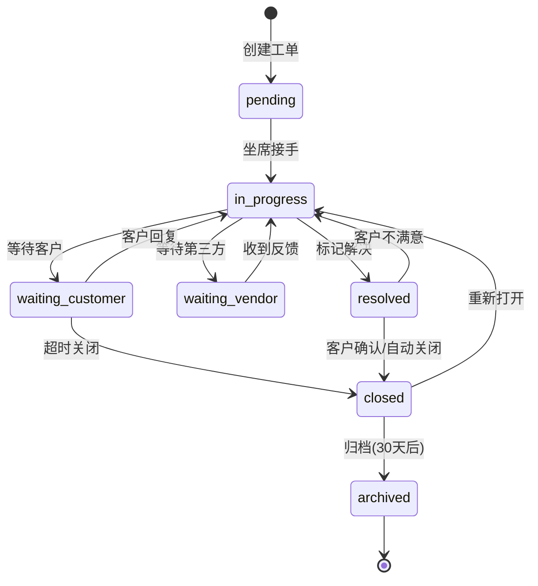

# L1-2-Part1: 工单核心功能需求

> **文档编号**: L1-2-Part1
> **文档版本**: v1.1
> **优先级**: P0（基础层 - 必须实现）
> **状态**: 🚧 开发中（MVP 已落地）
> **创建时间**: 2025-01-27
> **最后更新**: 2025-11-25

> **最新进度同步（2025-11-25）**
> - ✅ 完成工单状态历史、重开与手动归档 API（/api/tickets/{id}/reopen、/archive）
> - ✅ 已记录 SLA 关键时间点：`first_response_at`、`resolved_at`
> - ✅ 支持从会话一键创建工单并写回会话引用（/api/sessions/{session_name}/ticket）
> - ✅ 新增 `/api/tickets/manual`，支持手动创建工单
> - ✅ 新增 `/api/tickets/{id}/assign`，支持坐席分配/转派
> - ✅ 提供 `/api/tickets/archive/auto` 用于触发自动归档（30 天以上的关闭工单）
> - ✅ 提供 `/api/tickets/archived` 查询接口（按邮箱/日期过滤归档工单）
> - ✅ 新增 `/api/tickets/sla-summary` + `/api/tickets/sla-alerts`，输出 SLA 概览与超时告警
> - ⏳ SLA 可视化面板仍在规划

---

## 📑 文档导航

- **上级文档**: [ENTERPRISE_EBIKE_SUPPORT_TASKS.md](./ENTERPRISE_EBIKE_SUPPORT_TASKS.md)
- **同级文档**:
  - 当前: L1-2-Part1 工单核心功能
  - 下一篇: L1-2-Part2 工单协作与自动化
- **依赖关系**: 依赖 L1-1 会话管理功能

---

## 🎯 Part 1 概述

### 涵盖模块

本文档包含工单系统增强的前三个模块：

| 模块编号 | 模块名称 | 核心功能 |
|---------|---------|---------|
| **模块1** | 工单完整生命周期 | 创建→处理→解决→关闭→重开全流程 |
| **模块2** | 工单创建与分配 | 从会话创建、手动创建、智能分配 |
| **模块3** | 工单查询与搜索 | 多维度搜索、高级筛选、批量导出 |

### 业务价值

**当前痛点**（v3.4.0）：
- ✅ 已有基础工单系统
- ❌ 工单生命周期不完整（缺少重开、归档）
- ❌ 只能从会话创建工单，无法手动创建
- ❌ 工单分配全靠人工，效率低
- ❌ 工单搜索能力弱，无法快速定位

**实现后收益**：
- 📈 工单处理效率提升 **60%**（完整流程管理）
- 📈 工单响应速度提升 **50%**（智能分配）
- 📈 工单查找效率提升 **80%**（高级搜索）
- 📊 问题追踪准确率提升 **90%**

---

## 📋 模块1: 工单完整生命周期

### 1.1 功能概述

实现工单从创建到关闭的完整生命周期管理，支持状态流转、重开、归档等操作。

**参考对标**：
- Zendesk：完善的工单状态机
- JIRA Service Desk：强大的工单流转

### 1.2 工单状态机

#### 1.2.1 状态定义

**当前状态**（v3.4.0）：
```
open → in_progress → resolved → closed
```

**增强后状态**：

| 状态 | 英文名称 | 说明 | 谁可以设置 | 停留时间限制 |
|-----|----------|-----|-----------|-------------|
| 待处理 | `pending` | 工单已创建，等待坐席接手 | 系统 | 建议<10分钟 |
| 处理中 | `in_progress` | 坐席正在处理 | 坐席 | 建议<24小时 |
| 等待客户 | `waiting_customer` | 等待客户补充信息 | 坐席 | 建议<48小时 |
| 等待第三方 | `waiting_vendor` | 等待供应商/物流方反馈 | 坐席 | 建议<72小时 |
| 已解决 | `resolved` | 问题已解决，等待客户确认 | 坐席 | 建议<7天 |
| 已关闭 | `closed` | 工单已关闭 | 坐席/系统 | 永久 |
| 已归档 | `archived` | 工单已归档（不可见） | 系统 | 永久 |

#### 1.2.2 状态流转规则

**允许的流转路径**：



**状态流转权限**：

| 从状态 | 到状态 | 触发方式 | 权限要求 |
|-------|-------|---------|---------|
| pending | in_progress | 坐席点击"接手" | 任何坐席 |
| in_progress | waiting_customer | 坐席点击"等待客户" | 处理坐席 |
| in_progress | waiting_vendor | 坐席点击"等待第三方" | 处理坐席 |
| in_progress | resolved | 坐席点击"标记解决" | 处理坐席 |
| waiting_customer | in_progress | 客户回复消息 | 自动触发 |
| waiting_customer | closed | 48小时无回复 | 自动触发 |
| waiting_vendor | in_progress | 坐席点击"继续处理" | 处理坐席 |
| resolved | closed | 7天后自动关闭 | 自动触发 |
| resolved | in_progress | 客户点击"未解决" | 客户触发 |
| closed | in_progress | 坐席点击"重新打开" | 任何坐席 |
| closed | archived | 30天后自动归档 | 自动触发 |

#### 1.2.3 状态变更记录

**工单状态历史**：

```typescript
interface TicketStatusHistory {
  id: string                      // 历史记录ID
  ticket_id: string               // 工单ID
  from_status: TicketStatus       // 原状态
  to_status: TicketStatus         // 新状态
  changed_by: string              // 操作人（agent_id或"system"）
  change_reason: string           // 变更原因
  comment: string | null          // 备注说明
  changed_at: Date                // 变更时间
}
```

**示例记录**：
```json
{
  "id": "history_001",
  "ticket_id": "TKT-20250127-001",
  "from_status": "pending",
  "to_status": "in_progress",
  "changed_by": "agent_001",
  "change_reason": "接手工单",
  "comment": "客户反馈电池续航问题",
  "changed_at": "2025-01-27T10:30:00Z"
}
```

### 1.3 工单重开机制

#### 1.3.1 重开条件

**允许重开的场景**：

1. **客户主动请求**
   - 已关闭工单在30天内
   - 客户回复消息"问题又出现了"
   - 系统自动提示坐席重开

2. **坐席发现遗漏**
   - 发现问题未彻底解决
   - 需要补充处理
   - 手动重开

3. **重复问题**
   - 同一客户同类问题
   - 可以关联到原工单

**不允许重开的场景**：
- 工单已归档（超过30天）
- 工单被标记为"重复工单"
- 客户账户已注销

#### 1.3.2 重开操作流程

**UI交互**：
1. 坐席在工单详情页看到"重新打开"按钮（仅closed状态可见）
2. 点击后弹出确认对话框：
   ```
   重新打开工单 TKT-20250127-001

   原问题：电池续航问题
   原处理时间：2025-01-20
   关闭原因：已更换电池

   重开原因：[必填]
   ○ 问题未解决
   ○ 问题再次出现
   ○ 需要补充处理
   ○ 其他：___________

   备注说明：[可选]
   ___________________________

   [取消] [确认重开]
   ```

**后端处理**：
```python
@app.post("/api/tickets/{ticket_id}/reopen")
async def reopen_ticket(
    ticket_id: str,
    reason: str,
    comment: str = None,
    agent: Dict = Depends(require_agent)
):
    # 1. 验证工单状态
    ticket = get_ticket(ticket_id)
    if ticket.status != "closed":
        raise HTTPException(400, "INVALID_STATUS: 只能重开已关闭的工单")

    # 2. 检查归档状态
    if ticket.status == "archived":
        raise HTTPException(400, "TICKET_ARCHIVED: 已归档工单不能重开")

    # 3. 检查时间限制
    days_since_closed = (datetime.now() - ticket.closed_at).days
    if days_since_closed > 30:
        raise HTTPException(400, "TIME_LIMIT_EXCEEDED: 超过30天不能重开")

    # 4. 更新工单状态
    ticket.status = "in_progress"
    ticket.assigned_to = agent["agent_id"]  # 重新分配给操作坐席
    ticket.reopened_count += 1
    ticket.reopened_at = datetime.now()
    ticket.reopened_by = agent["agent_id"]

    # 5. 记录状态变更历史
    create_status_history(
        ticket_id=ticket_id,
        from_status="closed",
        to_status="in_progress",
        changed_by=agent["agent_id"],
        change_reason=f"重开工单: {reason}",
        comment=comment
    )

    # 6. 推送通知
    await notify_ticket_reopened(ticket_id, agent["agent_id"])

    return {"success": True, "ticket": ticket}
```

### 1.4 工单归档机制

#### 1.4.1 自动归档规则

**触发条件**：
- 工单状态为 `closed`
- 距离关闭时间超过30天
- 无客户新回复

**归档操作**：
```python
# 定时任务：每天凌晨2点执行
@scheduler.scheduled_job('cron', hour=2, minute=0)
async def archive_old_tickets():
    # 查找30天前关闭的工单
    cutoff_date = datetime.now() - timedelta(days=30)

    tickets_to_archive = redis_client.scan_iter("ticket:*")
    for ticket_key in tickets_to_archive:
        ticket = json.loads(redis_client.get(ticket_key))

        if (ticket["status"] == "closed" and
            datetime.fromisoformat(ticket["closed_at"]) < cutoff_date):

            # 1. 迁移到长期存储（如MySQL/PostgreSQL）
            archive_ticket_to_database(ticket)

            # 2. 更新状态为archived
            ticket["status"] = "archived"
            ticket["archived_at"] = datetime.now().isoformat()

            # 3. 从Redis删除（节省内存）
            redis_client.delete(ticket_key)

            logger.info(f"已归档工单: {ticket['ticket_id']}")
```

#### 1.4.2 归档工单查询

**查询已归档工单**：

```python
@app.get("/api/tickets/archived")
async def get_archived_tickets(
    customer_email: str = None,
    date_range: str = None,
    agent: Dict = Depends(require_agent)
):
    # 从数据库查询归档工单（不占用Redis内存）
    query = db.query(ArchivedTicket)

    if customer_email:
        query = query.filter_by(customer_email=customer_email)

    if date_range:
        start, end = parse_date_range(date_range)
        query = query.filter(
            ArchivedTicket.created_at.between(start, end)
        )

    tickets = query.order_by(ArchivedTicket.created_at.desc()).all()
    return {"tickets": tickets}
```

---

## 📋 模块2: 工单创建与分配

### 2.1 功能概述

支持多种工单创建方式和智能分配机制，提升工单处理效率。

**参考对标**：
- Zendesk：支持邮件、Web、API创建工单
- Freshdesk：智能分配算法

### 2.2 工单创建方式

#### 2.2.1 从会话创建（已有）

**当前实现**（v3.4.0）：
- ✅ 坐席在会话中点击"创建工单"
- ✅ 自动填充客户信息和会话内容

**增强功能**：
- 支持选择工单类型（咨询/投诉/售后）
- 支持设置优先级（低/中/高/紧急）
- 支持添加附件（聊天记录截图）

#### 2.2.2 手动创建工单（新增）

**业务场景**：
- 客户通过邮件反馈问题
- 客户电话咨询后补充工单
- 内部发现的产品问题

**UI设计**：

```
坐席工作台 > 工单管理 > [+新建工单]

┌─────────────────────────────────────────┐
│  创建新工单                              │
├─────────────────────────────────────────┤
│  客户信息 *                              │
│  ○ 选择现有客户                          │
│     [搜索客户: 邮箱/姓名/订单号]          │
│  ○ 新客户                                │
│     邮箱: [____________]                 │
│     姓名: [____________]                 │
│     电话: [____________]                 │
│                                          │
│  工单类型 *                              │
│  ○ 售前咨询  ○ 售后问题  ○ 投诉建议     │
│                                          │
│  问题分类 *                              │
│  [下拉选择: 产品质量/物流配送/退换货...] │
│                                          │
│  优先级 *                                │
│  ○ 低  ○ 中  ○ 高  ○ 紧急              │
│                                          │
│  标题 *                                  │
│  [_________________________________]     │
│                                          │
│  问题描述 *                              │
│  [                                   ]   │
│  [                                   ]   │
│  [                                   ]   │
│                                          │
│  关联订单（可选）                        │
│  [搜索订单号]                            │
│                                          │
│  上传附件                                │
│  [选择文件] (支持jpg/png/pdf, 最大10MB) │
│                                          │
│  分配给                                  │
│  ○ 自动分配                              │
│  ○ 指定坐席: [下拉选择]                  │
│                                          │
│  [取消]                    [创建工单]    │
└─────────────────────────────────────────┘
```

**后端实现**：

```python
@app.post("/api/tickets/create")
async def create_ticket(
    request: CreateTicketRequest,
    agent: Dict = Depends(require_agent)
):
    # 1. 验证必填字段
    if not all([request.customer_email, request.title,
                request.description, request.ticket_type]):
        raise HTTPException(400, "MISSING_REQUIRED_FIELDS")

    # 2. 生成工单ID
    ticket_id = generate_ticket_id()  # TKT-20250127-001

    # 3. 创建工单对象
    ticket = {
        "ticket_id": ticket_id,
        "customer_email": request.customer_email,
        "customer_name": request.customer_name,
        "customer_phone": request.customer_phone,
        "ticket_type": request.ticket_type,
        "category": request.category,
        "priority": request.priority,
        "title": request.title,
        "description": request.description,
        "status": "pending",
        "created_by": agent["agent_id"],
        "created_at": datetime.now().isoformat(),
        "assigned_to": None,  # 待分配
        "related_order_id": request.order_id,
        "attachments": request.attachments,
        "tags": [],
        "comments": []
    }

    # 4. 保存到Redis
    redis_client.setex(
        f"ticket:{ticket_id}",
        86400 * 30,  # 30天TTL
        json.dumps(ticket)
    )

    # 5. 自动分配（如果选择）
    if request.auto_assign:
        assigned_agent = await auto_assign_ticket(ticket)
        ticket["assigned_to"] = assigned_agent
        ticket["status"] = "in_progress"

    # 6. 推送通知
    await notify_ticket_created(ticket_id)

    return {"success": True, "ticket_id": ticket_id}
```

### 2.3 智能分配机制

#### 2.3.1 分配策略

**自动分配算法**：

```python
async def auto_assign_ticket(ticket: Dict) -> str:
    """
    智能分配工单给合适的坐席

    分配优先级：
    1. 专业技能匹配
    2. 工作负载均衡
    3. 历史服务记录
    4. 在线状态
    """

    # 1. 获取所有在线坐席
    online_agents = get_online_agents()

    # 2. 过滤：有对应技能标签的坐席
    category = ticket["category"]
    skilled_agents = [
        agent for agent in online_agents
        if category in agent.get("skills", [])
    ]

    # 如果没有专业坐席，使用所有在线坐席
    if not skilled_agents:
        skilled_agents = online_agents

    # 3. 检查历史服务记录（同一客户优先分配给熟悉的坐席）
    customer_email = ticket["customer_email"]
    history = get_customer_service_history(customer_email)

    if history and history["preferred_agent"] in [a["agent_id"] for a in skilled_agents]:
        # 优先分配给之前服务过的坐席
        return history["preferred_agent"]

    # 4. 负载均衡：选择当前工单数最少的坐席
    agent_workloads = [
        {
            "agent_id": agent["agent_id"],
            "current_tickets": get_agent_ticket_count(agent["agent_id"])
        }
        for agent in skilled_agents
    ]

    # 按工单数排序，选择最少的
    agent_workloads.sort(key=lambda x: x["current_tickets"])

    selected_agent = agent_workloads[0]["agent_id"]

    logger.info(
        f"工单 {ticket['ticket_id']} 自动分配给 {selected_agent} "
        f"(当前工单数: {agent_workloads[0]['current_tickets']})"
    )

    return selected_agent
```

#### 2.3.2 手动分配

**转派工单**：

```python
@app.post("/api/tickets/{ticket_id}/assign")
async def assign_ticket(
    ticket_id: str,
    target_agent_id: str,
    reason: str,
    agent: Dict = Depends(require_agent)
):
    ticket = get_ticket(ticket_id)

    # 验证目标坐席是否在线
    target_agent = get_agent(target_agent_id)
    if target_agent["status"] != "online":
        raise HTTPException(400, "TARGET_AGENT_OFFLINE")

    # 检查目标坐席工单负载
    current_load = get_agent_ticket_count(target_agent_id)
    if current_load >= target_agent["max_tickets"]:
        raise HTTPException(400, "TARGET_AGENT_OVERLOADED")

    # 更新分配
    old_agent = ticket["assigned_to"]
    ticket["assigned_to"] = target_agent_id
    ticket["status"] = "in_progress"

    # 记录分配历史
    create_assignment_history(
        ticket_id=ticket_id,
        from_agent=old_agent,
        to_agent=target_agent_id,
        assigned_by=agent["agent_id"],
        reason=reason
    )

    # 推送通知
    await notify_ticket_assigned(ticket_id, target_agent_id)

    return {"success": True}
```

---

## 📋 模块3: 工单查询与搜索

### 3.1 功能概述

提供强大的工单搜索和筛选能力，支持多维度组合查询。

**参考对标**：
- Zendesk：高级搜索语法
- ServiceNow：强大的筛选器

### 3.2 搜索维度

#### 3.2.1 基础搜索

**关键词搜索**：

| 搜索字段 | 说明 | 示例 |
|---------|------|------|
| 工单ID | 精确匹配 | `TKT-20250127-001` |
| 客户邮箱 | 模糊匹配 | `zhang@example.com` |
| 客户姓名 | 模糊匹配 | `张三` |
| 工单标题 | 全文搜索 | `电池续航` |
| 订单号 | 精确匹配 | `ORD123456` |

**UI设计**：

```
┌─────────────────────────────────────────┐
│  🔍 [搜索工单: ID/客户/标题/订单号_____] │
└─────────────────────────────────────────┘
```

**后端实现**：

```python
@app.get("/api/tickets/search")
async def search_tickets(
    query: str,
    agent: Dict = Depends(require_agent)
):
    # 优先尝试精确匹配（工单ID、订单号）
    if query.startswith("TKT-"):
        ticket = get_ticket(query)
        return {"tickets": [ticket] if ticket else []}

    if query.startswith("ORD"):
        tickets = search_by_order_id(query)
        return {"tickets": tickets}

    # 全文搜索
    results = []

    # 搜索所有工单
    for ticket_key in redis_client.scan_iter("ticket:*"):
        ticket = json.loads(redis_client.get(ticket_key))

        # 匹配条件
        if (query.lower() in ticket.get("customer_email", "").lower() or
            query.lower() in ticket.get("customer_name", "").lower() or
            query.lower() in ticket.get("title", "").lower() or
            query.lower() in ticket.get("description", "").lower()):
            results.append(ticket)

    # 按创建时间倒序
    results.sort(key=lambda x: x["created_at"], reverse=True)

    return {"tickets": results}
```

#### 3.2.2 高级筛选

**多维度筛选器**：

```
┌─────────────────────────────────────────────────────┐
│  高级筛选                                            │
├─────────────────────────────────────────────────────┤
│  状态:      [全部 ▼]                                │
│            ☐ 待处理  ☐ 处理中  ☐ 等待客户           │
│            ☐ 已解决  ☐ 已关闭                       │
│                                                      │
│  优先级:    [全部 ▼]                                │
│            ☐ 低  ☐ 中  ☐ 高  ☐ 紧急                │
│                                                      │
│  工单类型:  [全部 ▼]                                │
│            ☐ 售前咨询  ☐ 售后问题  ☐ 投诉建议       │
│                                                      │
│  问题分类:  [全部 ▼]                                │
│            [树形选择器: 产品质量/物流配送/退换货...] │
│                                                      │
│  分配坐席:  [全部 ▼]                                │
│            ☐ 未分配  ☐ 我的工单  [选择坐席 ▼]       │
│                                                      │
│  创建时间:  [今天 ▼]                                │
│            ○ 今天  ○ 最近3天  ○ 本周  ○ 本月       │
│            ○ 自定义: [开始日期] ~ [结束日期]         │
│                                                      │
│  标签:      [选择标签 +]                            │
│            🏷️ VIP客户  🏷️ 电池问题                  │
│                                                      │
│  [重置]                              [应用筛选]      │
└─────────────────────────────────────────────────────┘
```

**后端实现**：

```python
@app.post("/api/tickets/filter")
async def filter_tickets(
    filters: TicketFilters,
    agent: Dict = Depends(require_agent)
):
    tickets = []

    # 扫描所有工单
    for ticket_key in redis_client.scan_iter("ticket:*"):
        ticket = json.loads(redis_client.get(ticket_key))

        # 应用过滤条件
        if filters.status and ticket["status"] not in filters.status:
            continue

        if filters.priority and ticket["priority"] not in filters.priority:
            continue

        if filters.ticket_type and ticket["ticket_type"] not in filters.ticket_type:
            continue

        if filters.assigned_to:
            if filters.assigned_to == "unassigned" and ticket["assigned_to"]:
                continue
            if filters.assigned_to == "mine" and ticket["assigned_to"] != agent["agent_id"]:
                continue
            if ticket["assigned_to"] != filters.assigned_to:
                continue

        if filters.date_range:
            start, end = filters.date_range
            created_at = datetime.fromisoformat(ticket["created_at"])
            if not (start <= created_at <= end):
                continue

        if filters.tags:
            if not any(tag in ticket.get("tags", []) for tag in filters.tags):
                continue

        tickets.append(ticket)

    # 排序
    tickets.sort(
        key=lambda x: x[filters.sort_by],
        reverse=filters.sort_desc
    )

    return {"tickets": tickets, "total": len(tickets)}
```

### 3.3 批量导出

#### 3.3.1 导出功能

**导出格式**：
- CSV（适合Excel分析）
- Excel（带格式）
- PDF（打印报告）

**UI设计**：

```
工单列表页面右上角：
[导出] 按钮 -> 下拉菜单
  ○ 导出当前页 (20条)
  ○ 导出筛选结果 (156条)
  ○ 导出全部工单 (5000条) [需管理员权限]

选择格式：
  ○ CSV (.csv)
  ○ Excel (.xlsx)
  ○ PDF 报告 (.pdf)

[取消] [开始导出]
```

**后端实现**：

```python
@app.post("/api/tickets/export")
async def export_tickets(
    filters: TicketFilters,
    format: str,  # "csv", "xlsx", "pdf"
    agent: Dict = Depends(require_agent)
):
    # 1. 获取工单列表（应用筛选）
    tickets = await filter_tickets(filters, agent)

    # 2. 限制数量（防止内存溢出）
    if len(tickets["tickets"]) > 10000:
        raise HTTPException(400, "TOO_MANY_RECORDS: 最多导出10000条")

    # 3. 根据格式生成文件
    if format == "csv":
        file_content = generate_csv(tickets["tickets"])
        media_type = "text/csv"
        filename = f"tickets_{datetime.now().strftime('%Y%m%d_%H%M%S')}.csv"

    elif format == "xlsx":
        file_content = generate_excel(tickets["tickets"])
        media_type = "application/vnd.openxmlformats-officedocument.spreadsheetml.sheet"
        filename = f"tickets_{datetime.now().strftime('%Y%m%d_%H%M%S')}.xlsx"

    elif format == "pdf":
        file_content = generate_pdf_report(tickets["tickets"])
        media_type = "application/pdf"
        filename = f"ticket_report_{datetime.now().strftime('%Y%m%d_%H%M%S')}.pdf"

    # 4. 返回文件流
    return StreamingResponse(
        io.BytesIO(file_content),
        media_type=media_type,
        headers={
            "Content-Disposition": f"attachment; filename={filename}"
        }
    )
```

---

## 🔧 技术实现

### 数据模型

**工单对象结构**（增强版）：

```typescript
interface Ticket {
  // 基础信息
  ticket_id: string                   // 工单ID: TKT-20250127-001
  ticket_type: "pre_sale" | "after_sale" | "complaint"  // 工单类型
  category: string                    // 问题分类
  priority: "low" | "medium" | "high" | "urgent"  // 优先级
  status: TicketStatus                // 当前状态
  title: string                       // 工单标题
  description: string                 // 问题描述

  // 客户信息
  customer_email: string              // 客户邮箱
  customer_name: string               // 客户姓名
  customer_phone: string | null       // 客户电话

  // 分配信息
  created_by: string                  // 创建人
  assigned_to: string | null          // 当前处理坐席

  // 时间戳
  created_at: Date                    // 创建时间
  updated_at: Date                    // 最后更新
  first_response_at: Date | null      // 首次响应时间
  resolved_at: Date | null            // 解决时间
  closed_at: Date | null              // 关闭时间

  // 重开相关
  reopened_count: number              // 重开次数
  reopened_at: Date | null            // 最后重开时间
  reopened_by: string | null          // 重开操作人

  // 关联数据
  related_order_id: string | null     // 关联订单
  related_session_id: string | null   // 关联会话
  attachments: Attachment[]           // 附件列表
  tags: string[]                      // 标签

  // 评价
  rating: number | null               // 客户评分 1-5
  feedback: string | null             // 客户反馈
}
```

### API接口

**新增接口清单**：

| 接口 | 方法 | 说明 |
|-----|------|------|
| `/api/tickets/{id}/reopen` | POST | 重新打开工单 |
| `/api/tickets/{id}/archive` | POST | 手动归档工单 |
| `/api/tickets/archived` | GET | 查询归档工单 |
| `/api/tickets/create` | POST | 手动创建工单 |
| `/api/tickets/{id}/assign` | POST | 分配/转派工单 |
| `/api/tickets/search` | GET | 搜索工单 |
| `/api/tickets/filter` | POST | 高级筛选 |
| `/api/tickets/export` | POST | 批量导出 |
| `/api/tickets/{id}/status-history` | GET | 状态变更历史 |

---

## ✅ 验收标准

### 模块1: 工单生命周期

- [ ] 工单状态机实现正确，所有状态流转符合规则
- [ ] 工单重开功能正常，30天内可重开，超过30天拒绝
- [ ] 工单自动归档正常，30天后自动归档
- [ ] 状态变更历史完整记录
- [ ] 归档工单可查询但不占用Redis内存

### 模块2: 工单创建与分配

- [ ] 从会话创建工单功能增强完成
- [ ] 手动创建工单功能正常
- [ ] 智能分配算法实现，考虑技能、负载、历史
- [ ] 手动分配/转派功能正常
- [ ] 分配通知推送正常

### 模块3: 工单查询与搜索

- [ ] 关键词搜索支持ID、邮箱、姓名、标题、订单号
- [ ] 高级筛选支持多维度组合
- [ ] 搜索结果准确
- [ ] CSV/Excel/PDF导出功能正常
- [ ] 导出数量限制（防止内存溢出）

---

## 📊 性能指标

| 指标 | 目标值 | 说明 |
|-----|-------|------|
| 工单搜索响应时间 | < 500ms | 全文搜索10000条工单 |
| 工单重开操作 | < 200ms | 包括状态更新和通知 |
| 自动归档任务 | < 5分钟 | 处理1000条工单 |
| 导出10000条工单 | < 30秒 | CSV格式 |
| 智能分配算法 | < 100ms | 从50个坐席中选择 |

---

## 📝 后续优化

- [ ] 工单模板功能（快速创建常见工单）
- [ ] 工单批量操作（批量分配、批量关闭）
- [ ] 工单依赖关系（父子工单、关联工单）
- [ ] 工单优先级自动调整（SLA临近自动提升）
- [ ] 工单智能推荐（相似问题推荐历史解决方案）

---

**文档维护者**: Claude Code
**最后更新**: 2025-01-27
**下一篇**: [L1-2-Part2 工单协作与自动化](./L1-2-Part2_工单协作与自动化.md)
