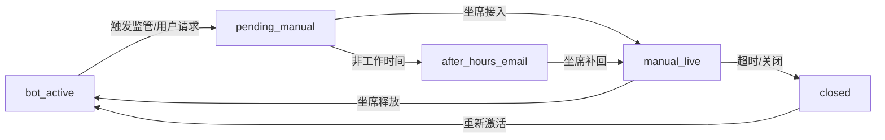

# AI 客服系统 - 完整企业级人工接管闭环方案 PRD v3.0

## 📋 文档信息

- **文档版本**: v3.0
- **更新时间**: 2025-11-21
- **文档状态**: 补充完善版（基于实际项目进度）
- **变更原因**: 基于项目实际实现情况，补充缺失的前端UI、坐席工作台、状态机完善等内容
- **目标**: 实现完整的、可用的、企业可落地的人工接管闭环功能

---

## 🎯 核心目标

**最终目标**：实现AI客服的人工接管完整闭环，当后端按照一定逻辑判断触发人工，并转接到人工时，人工可以实时在线回复，形成企业可落地的完整功能。

---

## 📊 当前项目状态评估（2025-11-21）

### ✅ 已完成部分（P0后端）

| 模块 | 完成度 | 说明 |
|------|--------|------|
| **SessionState** | ✅ 100% | 会话状态管理模型完整 |
| **Regulator** | ✅ 100% | 监管引擎（关键词、失败检测、VIP）|
| **核心API** | ✅ 100% | 4个人工接管API已实现 |
| **SSE推送** | ✅ 100% | 异步队列机制已实现 |
| **AI对话集成** | ✅ 100% | 监管触发已集成到对话流 |
| **测试覆盖** | ✅ 100% | API测试和SSE测试完成 |

**文件清单**：
- `backend.py` - 核心后端逻辑
- `src/session_state.py` - 会话状态模型
- `src/regulator.py` - 监管引擎
- `tests/test_p04_apis.py` - API测试
- `tests/test_p05_sse.py` - SSE测试

### ⚠️ 部分完成（存在问题）

| 模块 | 问题 | 影响 |
|------|------|------|
| **状态机转换** | pending_manual状态下AI未被阻止 | 用户可能在等待人工时继续与AI对话 |
| **状态转换API** | 缺少pending_manual→manual_live的转换接口 | 坐席无法正式接入会话 |
| **错误处理** | 部分异常场景未完整处理 | 可能导致状态不一致 |

### ❌ 未完成部分（关键缺失）

| 模块 | 完成度 | 说明 |
|------|--------|------|
| **用户前端UI** | ❌ 0% | 无状态展示、无人工消息渲染、无转人工按钮 |
| **坐席工作台** | ❌ 0% | 完全未实现，无法接管会话 |
| **会话列表API** | ❌ 0% | 缺少GET /api/sessions接口 |
| **接管API** | ❌ 0% | 缺少takeover接口（防抢单） |
| **工作时间判断** | ❌ 0% | 未实现ShiftConfig |
| **邮件通知** | ❌ 0% | 未实现邮件模块 |

---

## 🏗️ 完整架构设计

### 系统架构图

```
┌─────────────────────────────────────────────────────────────────┐
│                        用户前端 (Vue 3)                          │
│  ┌──────────────┐  ┌──────────────┐  ┌──────────────┐         │
│  │ 聊天界面      │  │ 状态指示器    │  │ 转人工按钮    │         │
│  │ ChatPanel    │  │ StatusBar    │  │ EscalateBtn  │         │
│  └──────┬───────┘  └──────┬───────┘  └──────┬───────┘         │
│         │                  │                  │                  │
│         └──────────────────┴──────────────────┘                 │
│                            │                                     │
└────────────────────────────┼─────────────────────────────────────┘
                             │
                             ↓
┌─────────────────────────────────────────────────────────────────┐
│                   FastAPI 后端服务                               │
│                                                                  │
│  ┌─────────────────────────────────────────────────────┐       │
│  │              AI 对话核心（不可修改）                  │       │
│  │  • /api/chat (同步)                                  │       │
│  │  • /api/chat/stream (SSE流式)                        │       │
│  │  • Coze API 调用逻辑                                 │       │
│  └─────────────────────────────────────────────────────┘       │
│                                                                  │
│  ┌─────────────────────────────────────────────────────┐       │
│  │          人工接管扩展（新增功能）                     │       │
│  │                                                      │       │
│  │  ┌────────────────┐    ┌────────────────┐          │       │
│  │  │ SessionStore   │◄───┤  Regulator     │          │       │
│  │  │ 会话状态管理    │    │  监管引擎       │          │       │
│  │  └────────┬───────┘    └────────────────┘          │       │
│  │           │                                          │       │
│  │           ↓                                          │       │
│  │  ┌────────────────┐    ┌────────────────┐          │       │
│  │  │ SSE Queue      │    │ Manual APIs    │          │       │
│  │  │ 消息队列        │    │ 人工接口        │          │       │
│  │  └────────────────┘    └────────────────┘          │       │
│  └─────────────────────────────────────────────────────┘       │
└────────────────────────────┬────────────────────────────────────┘
                             │
                             ↓
┌─────────────────────────────────────────────────────────────────┐
│                   坐席工作台 (Vue 3)                             │
│  ┌──────────────┐  ┌──────────────┐  ┌──────────────┐         │
│  │ 会话队列      │  │ 聊天面板      │  │ 操作按钮      │         │
│  │ SessionQueue │  │ ChatPanel    │  │ Actions      │         │
│  └──────────────┘  └──────────────┘  └──────────────┘         │
└─────────────────────────────────────────────────────────────────┘
```

---

## 📐 完整状态机设计

### 会话状态定义

```python
class SessionStatus(str, Enum):
    BOT_ACTIVE = "bot_active"           # AI服务中
    PENDING_MANUAL = "pending_manual"   # 等待人工接入
    MANUAL_LIVE = "manual_live"         # 人工服务中
    AFTER_HOURS_EMAIL = "after_hours_email"  # 非工作时间已发邮件
    CLOSED = "closed"                   # 已关闭
```

### 状态转换流程



### 触发条件详解

| 状态转换 | 触发条件 | 执行者 | API |
|---------|----------|--------|-----|
| **bot_active → pending_manual** | 1. 关键词匹配<br>2. AI连续失败≥3次<br>3. VIP用户<br>4. 用户点击"转人工" | 系统/用户 | `/api/manual/escalate` |
| **pending_manual → manual_live** | 坐席点击"接入" | 坐席 | `/api/sessions/{id}/takeover` |
| **manual_live → bot_active** | 坐席点击"结束服务" | 坐席 | `/api/sessions/{id}/release` |
| **pending_manual → after_hours_email** | 非工作时间触发 | 系统 | 自动 |
| **manual_live → closed** | 超时/主动关闭 | 系统/坐席 | `/api/sessions/{id}/close` |

---

## 🔧 完整功能需求（分阶段实现）

### P0-补充阶段（当前急需）

**目标**：修复已发现的问题，补充缺失的基础功能

| 模块 | 任务 | 优先级 | 工作量 |
|------|------|--------|--------|
| **后端状态机修复** | 修复pending_manual状态下AI未被阻止的问题 | 🔴 P0 | 2小时 |
| **新增takeover API** | 实现坐席接入接口（防抢单逻辑） | 🔴 P0 | 3小时 |
| **新增sessions列表API** | 实现会话列表查询接口 | 🔴 P0 | 2小时 |
| **错误处理完善** | 完善异常场景处理 | 🟡 P1 | 2小时 |

### P1-前端改造阶段

**目标**：实现用户端完整UI和交互

| 模块 | 任务 | 优先级 | 工作量 | 文件 |
|------|------|--------|--------|------|
| **状态管理扩展** | 添加sessionStatus、escalationInfo等状态 | 🔴 P0 | 1小时 | `chatStore.ts` |
| **Message类型扩展** | 支持agent、system角色 | 🔴 P0 | 1小时 | `types/index.ts` |
| **状态指示器** | 顶部状态条组件 | 🔴 P0 | 2小时 | `StatusBar.vue` (新建) |
| **转人工按钮** | 添加主动转人工入口 | 🔴 P0 | 1小时 | `ChatPanel.vue` |
| **人工消息渲染** | 支持agent角色消息显示 | 🔴 P0 | 2小时 | `ChatMessage.vue` |
| **SSE事件扩展** | 处理manual_message和status_change事件 | 🔴 P0 | 2小时 | `api/chat.ts` |
| **输入控制** | 根据状态切换发送接口 | 🔴 P0 | 2小时 | `ChatPanel.vue` |
| **历史回填** | 打开面板时加载历史消息 | 🟡 P1 | 2小时 | `ChatPanel.vue` |

**总计工作量**：约12-14小时

### P2-坐席工作台阶段

**目标**：实现坐席端完整功能

| 模块 | 任务 | 优先级 | 工作量 |
|------|------|--------|--------|
| **项目初始化** | 创建agent-workbench子项目 | 🔴 P0 | 2小时 |
| **登录鉴权** | 实现坐席登录（JWT role=agent） | 🔴 P0 | 3小时 |
| **会话队列** | 展示待接入/进行中会话列表 | 🔴 P0 | 4小时 |
| **聊天面板** | 实时聊天界面（复用用户端组件） | 🔴 P0 | 3小时 |
| **接入操作** | 接入/释放会话功能 | 🔴 P0 | 2小时 |
| **实时更新** | SSE/轮询机制 | 🟡 P1 | 3小时 |
| **快捷短语** | 常用回复模板 | 🟢 P2 | 2小时 |

**总计工作量**：约19-21小时

### P3-增强功能阶段（可选）

| 功能 | 说明 | 优先级 |
|------|------|--------|
| 工作时间判断 | ShiftConfig配置 | 🟢 P2 |
| 邮件通知 | 非工作时间自动发邮件 | 🟢 P2 |
| 消息模板 | 快捷回复、话术库 | 🟢 P2 |
| 会话转接 | 坐席间转接 | 🟢 P2 |
| 质检功能 | 会话录音、评分 | 🟢 P2 |
| 数据统计 | 接入量、响应时长等 | 🟢 P2 |

---

## 🎨 用户前端UI设计规范

### 1. 状态指示器设计

**位置**：聊天面板顶部（头像右侧）

**状态样式**：

| 状态 | 显示文本 | 颜色 | 图标 |
|------|----------|------|------|
| bot_active | "AI服务中" | 绿色 #10B981 | 🤖 |
| pending_manual | "等待人工接入..." | 黄色 #F59E0B | ⏳ |
| manual_live | "人工客服 - {坐席名称}" | 蓝色 #3B82F6 | 👤 |
| after_hours_email | "非工作时间" | 灰色 #6B7280 | 📧 |

**实现示例**：

```vue
<template>
  <div class="status-bar" :class="statusClass">
    <span class="status-icon">{{ statusIcon }}</span>
    <span class="status-text">{{ statusText }}</span>
  </div>
</template>

<script setup lang="ts">
import { computed } from 'vue'
import { useChatStore } from '@/stores/chatStore'

const chatStore = useChatStore()

const statusIcon = computed(() => {
  switch (chatStore.sessionStatus) {
    case 'bot_active': return '🤖'
    case 'pending_manual': return '⏳'
    case 'manual_live': return '👤'
    case 'after_hours_email': return '📧'
    default: return ''
  }
})

const statusText = computed(() => {
  switch (chatStore.sessionStatus) {
    case 'bot_active': return 'AI服务中'
    case 'pending_manual': return '等待人工接入...'
    case 'manual_live':
      return `人工客服 - ${chatStore.agentName || '客服'}`
    case 'after_hours_email': return '非工作时间'
    default: return ''
  }
})

const statusClass = computed(() => {
  return `status-${chatStore.sessionStatus}`
})
</script>

<style scoped>
.status-bar {
  padding: 8px 16px;
  border-radius: 20px;
  display: inline-flex;
  align-items: center;
  gap: 6px;
  font-size: 13px;
  font-weight: 500;
}

.status-bot_active {
  background: #D1FAE5;
  color: #065F46;
}

.status-pending_manual {
  background: #FEF3C7;
  color: #92400E;
}

.status-manual_live {
  background: #DBEAFE;
  color: #1E40AF;
}

.status-after_hours_email {
  background: #F3F4F6;
  color: #374151;
}
</style>
```

### 2. 转人工按钮设计

**位置**：聊天输入框右侧或气泡菜单中

**设计方案A**：独立按钮（推荐）

```vue
<button
  class="escalate-button"
  @click="handleEscalate"
  :disabled="isEscalating || sessionStatus !== 'bot_active'"
>
  <svg class="icon"><!-- 人工图标 --></svg>
  <span>转人工</span>
</button>
```

**设计方案B**：集成到气泡菜单

```vue
<div class="sub-bubbles">
  <button class="sub-bubble" @click="handleEscalate">
    <span class="bubble-text">转人工客服</span>
  </button>
  <button class="sub-bubble" @click="handleClearConversation">
    <span class="bubble-text">清除对话</span>
  </button>
  <button class="sub-bubble" @click="handleNewSession">
    <span class="bubble-text">新建对话</span>
  </button>
</div>
```

### 3. 人工消息样式

**区别于AI消息的设计**：

- **头像**：使用坐席头像（默认图标👤）
- **昵称**：显示坐席名称
- **背景色**：使用不同的背景色（如浅蓝色）
- **标签**：添加"人工"标签

```vue
<template>
  <div class="message" :class="messageClass">
    <div class="message-avatar" v-if="message.role !== 'user'">
      <!-- Agent头像 -->
      <div v-if="message.role === 'agent'" class="agent-avatar">
        <span class="agent-icon">👤</span>
      </div>
      <!-- AI头像 -->
      
    </div>

    <div class="message-body">
      <div class="message-header" v-if="message.role === 'agent'">
        <span class="agent-name">{{ message.agent_name || '客服' }}</span>
        <span class="agent-badge">人工</span>
      </div>
      <div class="message-content">{{ message.content }}</div>
    </div>
  </div>
</template>

<style scoped>
.message.agent .message-body {
  background: #EFF6FF; /* 浅蓝色背景 */
  border-left: 3px solid #3B82F6;
}

.agent-badge {
  background: #3B82F6;
  color: white;
  padding: 2px 8px;
  border-radius: 10px;
  font-size: 11px;
  font-weight: 500;
}

.agent-avatar {
  background: linear-gradient(135deg, #667eea 0%, #764ba2 100%);
  display: flex;
  align-items: center;
  justify-content: center;
}
</style>
```

---

## 🖥️ 坐席工作台UI设计规范

### 1. 整体布局

```
┌────────────────────────────────────────────────────┐
│  Header (顶部导航栏)                                │
│  坐席工作台 | 张三 (在线) | 今日接待: 12 | 退出     │
├──────────────┬─────────────────────────────────────┤
│              │                                     │
│  会话队列     │        聊天面板                      │
│  (左侧 30%)  │        (右侧 70%)                    │
│              │                                     │
│  ┌────────┐  │  ┌─────────────────────────────┐   │
│  │ 待接入  │  │  │ 会话信息                     │   │
│  │ (3)    │  │  │ 访客A | VIP | 等待中          │   │
│  └────────┘  │  └─────────────────────────────┘   │
│              │                                     │
│  ┌────────┐  │  ┌─────────────────────────────┐   │
│  │ 进行中  │  │  │ 消息历史                     │   │
│  │ (2)    │  │  │                             │   │
│  └────────┘  │  │                             │   │
│              │  │                             │   │
│  ┌────────┐  │  └─────────────────────────────┘   │
│  │ 已完成  │  │                                     │
│  │ (15)   │  │  ┌─────────────────────────────┐   │
│  └────────┘  │  │ 输入框 + 快捷短语              │   │
│              │  └─────────────────────────────┘   │
│              │                                     │
│              │  [接入会话] [结束服务] [转接]        │
└──────────────┴─────────────────────────────────────┘
```

### 2. 会话队列设计

**卡片式列表**：

```vue
<template>
  <div class="session-list">
    <div class="session-tabs">
      <button
        class="tab"
        :class="{ active: activeTab === 'pending' }"
        @click="activeTab = 'pending'"
      >
        待接入 ({{ pendingCount }})
      </button>
      <button
        class="tab"
        :class="{ active: activeTab === 'live' }"
        @click="activeTab = 'live'"
      >
        进行中 ({{ liveCount }})
      </button>
    </div>

    <div class="session-cards">
      <div
        v-for="session in filteredSessions"
        :key="session.session_name"
        class="session-card"
        :class="{ selected: selectedSession === session.session_name }"
        @click="selectSession(session)"
      >
        <div class="card-header">
          <span class="user-name">{{ session.user_profile.nickname }}</span>
          <span v-if="session.user_profile.vip" class="vip-badge">VIP</span>
        </div>

        <div class="card-body">
          <div class="last-message">
            {{ session.last_message_preview?.content }}
          </div>
          <div class="escalation-reason" v-if="session.escalation">
            原因: {{ getReasonText(session.escalation.reason) }}
          </div>
        </div>

        <div class="card-footer">
          <span class="waiting-time">
            等待 {{ formatWaitingTime(session.escalation?.trigger_at) }}
          </span>
          <span class="severity-badge" :class="session.escalation?.severity">
            {{ session.escalation?.severity }}
          </span>
        </div>
      </div>
    </div>
  </div>
</template>
```

### 3. 快捷短语设计

**下拉菜单或侧边栏**：

```vue
<template>
  <div class="quick-replies">
    <button class="quick-reply-trigger" @click="showQuickReplies = !showQuickReplies">
      快捷短语 ▼
    </button>

    <div v-if="showQuickReplies" class="quick-reply-list">
      <div
        v-for="(reply, index) in quickReplies"
        :key="index"
        class="quick-reply-item"
        @click="insertQuickReply(reply.content)"
      >
        <div class="reply-title">{{ reply.title }}</div>
        <div class="reply-preview">{{ reply.content.substring(0, 30) }}...</div>
      </div>
    </div>
  </div>
</template>

<script setup lang="ts">
const quickReplies = [
  { title: '欢迎语', content: '您好，我是客服小王，很高兴为您服务！' },
  { title: '查询订单', content: '请提供您的订单号，我帮您查询。' },
  { title: '退换货', content: '我们支持7天无理由退换货，请问您遇到什么问题？' },
  { title: '结束语', content: '感谢您的咨询，祝您生活愉快！' }
]
</script>
```

---

## 🔌 完整API规范

### 后端新增API（补充）

#### 1. 获取会话列表

```http
GET /api/sessions
Query Parameters:
  - status: string (可选) - pending_manual, manual_live, after_hours_email
  - limit: int (默认50)
  - offset: int (默认0)

Response 200:
{
  "success": true,
  "data": {
    "sessions": [
      {
        "session_name": "session_123",
        "status": "pending_manual",
        "user_profile": { "nickname": "访客A", "vip": true },
        "last_message_preview": { "role": "user", "content": "我要人工", "timestamp": 1763605000 },
        "escalation": { "reason": "keyword", "trigger_at": 1763605000, "waiting_seconds": 120 },
        "assigned_agent": null,
        "updated_at": 1763605000
      }
    ],
    "total": 5,
    "has_more": false
  }
}
```

#### 2. 坐席接入会话（防抢单）

```http
POST /api/sessions/{session_name}/takeover
Headers:
  Authorization: Bearer {JWT_TOKEN}  # role=agent
Body:
{
  "agent_id": "agent_001",
  "agent_name": "小王"
}

Response 200:
{
  "success": true,
  "data": {
    "session_name": "session_123",
    "status": "manual_live",
    "assigned_agent": {
      "id": "agent_001",
      "name": "小王"
    }
  }
}

Response 409:
{
  "success": false,
  "error": "ALREADY_TAKEN",
  "message": "会话已被坐席【小张】接入"
}
```

#### 3. 会话统计接口

```http
GET /api/sessions/stats
Response 200:
{
  "success": true,
  "data": {
    "total_sessions": 50,
    "by_status": {
      "bot_active": 35,
      "pending_manual": 3,
      "manual_live": 2,
      "after_hours_email": 5,
      "closed": 5
    },
    "active_agents": 2,
    "avg_waiting_time": 120  // 秒
  }
}
```

---

## 🧪 完整测试方案

### 1. 单元测试

**后端测试**：
- SessionState状态转换测试
- Regulator监管逻辑测试
- API接口测试（已完成）

**前端测试**：
- Store状态管理测试
- 组件渲染测试
- SSE事件处理测试

### 2. 集成测试

**场景1：用户主动转人工**
1. 用户打开聊天
2. 点击"转人工"按钮
3. 验证状态变为pending_manual
4. 坐席看到待接入提示
5. 坐席点击接入
6. 验证状态变为manual_live
7. 用户收到"客服已接入"提示
8. 双方正常对话
9. 坐席点击"结束服务"
10. 验证状态恢复bot_active

**场景2：关键词触发**
1. 用户输入"我要人工"
2. 系统自动触发升级
3. 验证状态变为pending_manual
4. 后续流程同场景1

**场景3：AI失败触发**
1. 用户连续3次收到AI失败回复
2. 系统自动触发升级
3. 验证状态变为pending_manual
4. 后续流程同场景1

**场景4：VIP用户**
1. VIP用户发送消息
2. 系统自动触发升级
3. 优先级为HIGH
4. 后续流程同场景1

### 3. 端到端测试

使用Playwright或Cypress编写E2E测试：

```typescript
test('完整人工接管流程', async ({ page }) => {
  // 用户端
  await page.goto('http://localhost:5173')
  await page.click('[data-testid="chat-button"]')
  await page.fill('[data-testid="chat-input"]', '我要人工')
  await page.click('[data-testid="send-button"]')

  // 验证状态变化
  await expect(page.locator('[data-testid="status-bar"]'))
    .toHaveText('等待人工接入...')

  // 坐席端
  await page.goto('http://localhost:5174/agent')
  await page.fill('[data-testid="agent-login"]', 'agent_001')
  await page.click('[data-testid="login-button"]')

  // 接入会话
  await page.click('[data-testid="session-card-0"]')
  await page.click('[data-testid="takeover-button"]')

  // 发送消息
  await page.fill('[data-testid="agent-input"]', '您好，我是客服')
  await page.click('[data-testid="agent-send"]')

  // 用户端验证收到消息
  await page.goto('http://localhost:5173')
  await expect(page.locator('[data-testid="message-agent"]'))
    .toContainText('您好，我是客服')
})
```

---

## 📅 实施计划（建议时间线）

### 第1周：后端补充（5天）

**Day 1-2**：状态机修复和API补充
- 修复pending_manual状态下AI阻止逻辑
- 实现takeover接口（防抢单）
- 实现sessions列表接口
- 完善错误处理

**Day 3-4**：测试和文档
- 编写补充API的测试
- 更新API文档
- 进行集成测试

**Day 5**：Review和优化
- 代码审查
- 性能测试
- Bug修复

### 第2周：用户前端改造（5天）

**Day 1-2**：状态管理和基础组件
- 扩展chatStore（sessionStatus、escalationInfo）
- 创建StatusBar组件
- 扩展Message类型

**Day 3-4**：交互功能
- 实现转人工按钮
- 实现人工消息渲染
- 实现SSE事件扩展
- 实现输入控制逻辑

**Day 5**：测试和优化
- 组件测试
- 集成测试
- UI优化

### 第3周：坐席工作台（7天）

**Day 1-2**：项目搭建
- 创建agent-workbench子项目
- 实现登录鉴权
- 实现基础布局

**Day 3-4**：核心功能
- 实现会话队列
- 实现聊天面板
- 实现接入/释放操作

**Day 5-6**：增强功能
- 实现快捷短语
- 实现实时更新
- 优化UI/UX

**Day 7**：测试和发布
- 端到端测试
- 用户验收
- 部署上线

### 第4周：增强功能（可选）

- 工作时间判断
- 邮件通知
- 数据统计
- 质检功能

---

## ✅ 验收标准

### 核心功能验收

| 功能 | 验收标准 |
|------|----------|
| **AI对话** | 在bot_active状态下，AI对话流程完整无误 |
| **状态展示** | 用户端能清晰看到当前状态（AI/等待/人工） |
| **转人工** | 用户点击按钮后能成功触发升级 |
| **自动触发** | 关键词、失败、VIP能正确触发升级 |
| **坐席接入** | 坐席能看到待接入列表并成功接入 |
| **实时对话** | 用户和坐席能实时收发消息 |
| **释放会话** | 坐席结束后状态正确恢复为AI模式 |
| **会话隔离** | 多会话互不干扰，坐席只能看到自己的会话 |

### 性能标准

| 指标 | 目标 |
|------|------|
| API响应时间 | < 200ms |
| SSE推送延迟 | < 100ms |
| 页面加载时间 | < 2s |
| 并发用户 | 支持100+并发 |
| 坐席数量 | 支持10+坐席同时在线 |

### 稳定性标准

| 指标 | 目标 |
|------|------|
| 可用性 | 99.9% |
| 错误率 | < 0.1% |
| 平均故障恢复时间 | < 5分钟 |
| 状态一致性 | 100% |

---

## 📚 相关文档

1. **PRD文档**
   - `prd/prd.md` - 原始PRD v2.2
   - `prd/PRD_COMPLETE_v3.0.md` - 本文档（补充完善版）

2. **任务拆解**
   - `prd/backend_tasks.md` - 后端任务
   - `prd/frontend_client_tasks.md` - 前端用户端任务
   - `prd/agent_workbench_tasks.md` - 坐席工作台任务

3. **技术文档**
   - `prd/TECHNICAL_CONSTRAINTS.md` - 技术约束
   - `prd/api_contract.md` - API规范
   - `docs/P0-API使用示例.md` - API使用示例

4. **实现文档**
   - `docs/P0-完成总结.md` - P0完成总结
   - `README.md` - 项目说明

---

## 🎯 下一步行动

### 立即开始（本周）

1. **修复后端状态机** (Day 1)
   - 修复pending_manual状态下AI未被阻止的问题
   - 测试验证

2. **实现补充API** (Day 2-3)
   - 实现takeover接口
   - 实现sessions列表接口
   - 编写测试

3. **启动前端改造** (Day 4-5)
   - 扩展状态管理
   - 创建StatusBar组件
   - 添加转人工按钮

### 后续计划

- **Week 2**: 完成用户前端改造
- **Week 3**: 完成坐席工作台
- **Week 4**: 增强功能（可选）

---

**文档维护者**: Claude Code
**最后更新**: 2025-11-21
**文档版本**: v3.0
**状态**: ✅ 已完成
